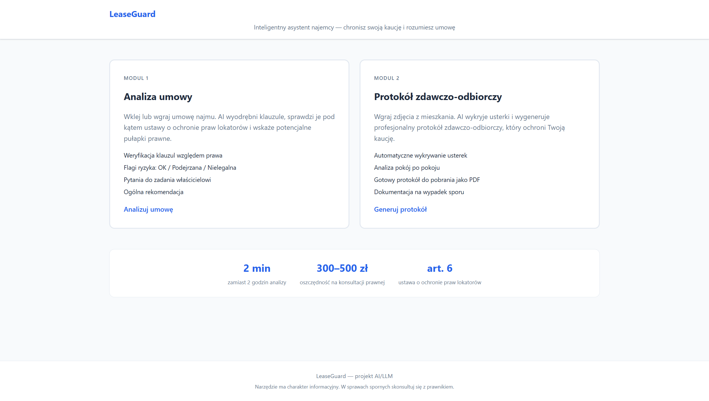
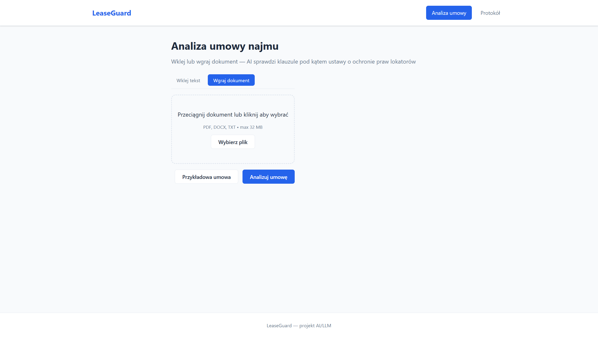
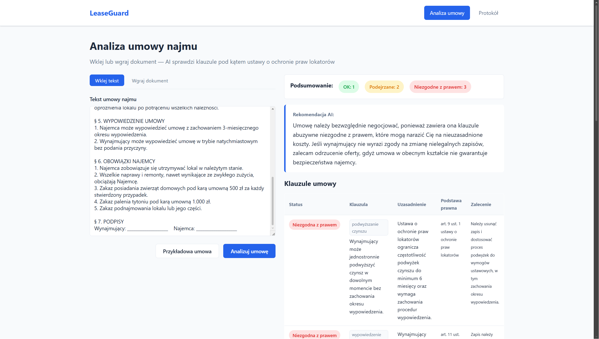
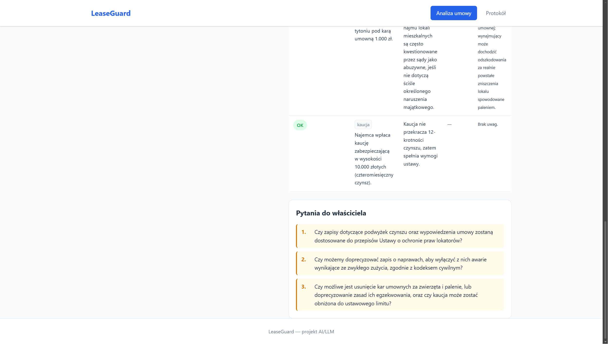
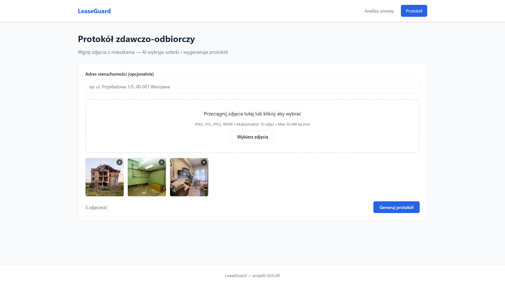
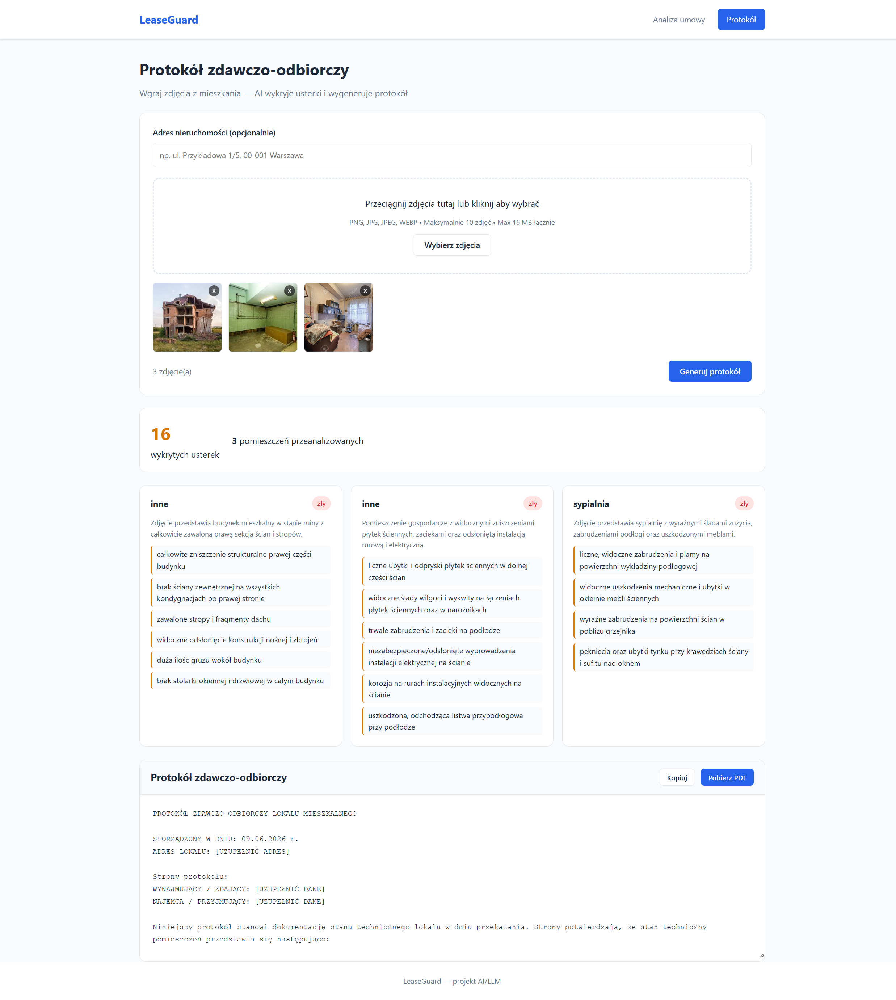

# LeaseGuard — Inteligentny asystent najemcy

## Demo

### Strona główna


### Moduł 1 — Analiza umowy (golden path)




### Moduł 2 — Protokół zdawczo-odbiorczy (golden path)



---

## Kontekst biznesowy

**Branża:** PropTech / Nieruchomości / LegalTech

**Docelowi odbiorcy:**
- Firmy zarządzające nieruchomościami (np. Mzuri)
- Agencje nieruchomości (np. Metrohouse, Freedom Nieruchomości)
- Platformy ogłoszeniowe (np. Otodom)

Wszyscy mają interes w automatycznej weryfikacji umów najmu przed podpisaniem — buduje to zaufanie klientów i ogranicza spory.

---

## Problem

Najemca podpisuje umowę najmu — 8 stron prawniczego języka — i jednocześnie odbiera klucze bez protokołu. Nie wie:

- czy kaucja 3-miesięczna jest w granicach prawa,
- czy właściciel może wejść do mieszkania bez uprzedzenia,
- czy odpowiada za zniszczenia, które zastał przy wprowadzeniu.

Rok później **traci kaucję** za rysy, które były na ścianie przed jego wprowadzeniem.

Weryfikacja umowy u prawnika kosztuje **300–500 zł** i trwa **2 godziny**. LeaseGuard robi to w **2 minuty** i **0 zł**.

---

## Rozwiązanie

LeaseGuard to webowa aplikacja AI działająca w dwóch modułach:

### Moduł 1 — Analiza umowy najmu

Użytkownik wkleja lub wgrywa (PDF, DOCX) tekst umowy najmu. Agenci AI:

1. Wyciągają wszystkie klauzule (kaucja, czynsz, wypowiedzenie, naprawy, zakazy, kary umowne)
2. Weryfikują każdą klauzulę względem **ustawy o ochronie praw lokatorów** przy użyciu RAG (ChromaDB)
3. Klasyfikują ryzyko: OK / Podejrzana / Niezgodna z prawem
4. Podają konkretną podstawę prawną naruszenia
5. Generują listę pytań do zadania właścicielowi przed podpisaniem

### Moduł 2 — Protokół zdawczo-odbiorczy

Użytkownik wgrywa zdjęcia z mieszkania (do 10 zdjęć). Agenci AI:

1. Wykrywają usterki pokój po pokoju przy użyciu Gemini Vision
2. Oceniają stan każdego pomieszczenia
3. Generują gotowy protokół zdawczo-odbiorczy z opisami usterek
4. Eksportują protokół do PDF gotowego do podpisu

---

## Architektura systemu

```
Moduł 1 — Analiza umowy
  ExtractorAgent     wyciąga i analizuje klauzule z tekstu umowy
       |
       v
  RAG (ChromaDB)     pobiera relewantne artykuły ustawy z bazy wektorowej
       |
       v
  AdvisorAgent       generuje pytania do właściciela i rekomendację końcową

Moduł 2 — Protokół
  PhotoAnalysisAgent     Gemini Vision analizuje każde zdjęcie osobno
       |
       v
  ProtocolAgent          składa wyniki w jeden protokół zdawczo-odbiorczy
```

### Agenci i ich odpowiedzialności

| Agent | Plik | Odpowiedzialność |
|---|---|---|
| `ExtractorAgent` | `agents/extractor.py` | Ekstrakcja klauzul z tekstu umowy + ocena względem ustawy (RAG) |
| `AdvisorAgent` | `agents/advisor.py` | Rekomendacja końcowa + pytania do właściciela |
| `PhotoAnalysisAgent` | `agents/photo.py` | Analiza zdjęć — wykrywanie usterek, ocena stanu pomieszczeń |
| `ProtocolAgent` | `agents/protocol.py` | Generowanie tekstu protokołu zdawczo-odbiorczego |

---

## Stack technologiczny

| Warstwa | Technologia |
|---|---|
| LLM + Vision | Google Gemini 2.0 Flash (łańcuch fallback przez 6 modeli Gemini) |
| RAG — baza wektorowa | ChromaDB (wbudowane embeddingi) |
| Structured output | Pydantic v2 (modele: `ContractClause`, `ClauseRisk`, `RoomCondition`, `LeaseReport`, `HandoverProtocol`) |
| Backend | Python 3.11 + Flask |
| Frontend | HTML / CSS / JavaScript (vanilla) |
| Eksport PDF | fpdf2 |
| Parsowanie dokumentów | PyMuPDF (PDF), python-docx (DOCX) |

---

## Źródła danych

| Źródło | Zastosowanie |
|---|---|
| ISAP ELI API (`api.sejm.gov.pl`) | Pobieranie tekstu ustawy o ochronie praw lokatorów — baza RAG |
| Zdjęcia wgrane przez użytkownika | Analiza Gemini Vision — wykrywanie usterek |
| Syntetyczne umowy najmu | Dane testowe do demonstracji modułu analizy |
| Syntetyczne zdjęcia mieszkań | Dane testowe do demonstracji modułu protokołu |

Podstawa prawna RAG: **Ustawa z dnia 21 czerwca 2001 r. o ochronie praw lokatorów, mieszkaniowym zasobie gminy i o zmianie Kodeksu cywilnego** (Dz.U. 2001 nr 71 poz. 733 ze zm.)

---

## Modele Pydantic (structured output)

```python
class ContractClause(BaseModel):
    clause_type: str          # typ klauzuli (kaucja, czynsz, wypowiedzenie…)
    content: str              # opis klauzuli
    raw_excerpt: str          # cytat z umowy
    article_reference: str | None

class ClauseRisk(BaseModel):
    clause: ContractClause
    status: Literal["ok", "warning", "illegal"]
    justification: str        # uzasadnienie oceny
    legal_basis: str | None   # art. X ustawy lub KC
    recommendation: str

class RoomCondition(BaseModel):
    room_name: str
    defects: list[str]
    general_condition: Literal["dobry", "średni", "zły"]
    recommendations: list[str]
    photo_description: str
```

---

## Instalacja i uruchomienie

```bash
# 1. Sklonuj repozytorium
git clone https://github.com/DawidZabek/leaseguard
cd leaseguard

# 2. Utwórz i aktywuj środowisko wirtualne
python -m venv venv
source venv/bin/activate       # Windows: venv\Scripts\activate

# 3. Zainstaluj zależności
pip install -r requirements.txt

# 4. Skonfiguruj klucz API Gemini
cp .env.example .env
# Uzupełnij GEMINI_API_KEY w pliku .env

# 5. Uruchom aplikację
python app.py
```

Aplikacja dostępna pod: **http://localhost:5000**

---

## Struktura projektu

```
leaseguard/
├── app.py                            # Flask — endpointy API i eksport PDF
├── agents/
│   ├── extractor.py                  # ExtractorAgent — ekstrakcja + analiza klauzul (RAG)
│   ├── advisor.py                    # AdvisorAgent — rekomendacja + pytania
│   ├── photo.py                      # PhotoAnalysisAgent — Gemini Vision
│   ├── protocol.py                   # ProtocolAgent — generowanie protokołu
│   └── utils.py                      # Gemini multi-model fallback + rotacja kluczy API
├── models/
│   └── schemas.py                    # Pydantic v2 — modele danych
├── rag/
│   └── setup.py                      # ChromaDB — ładowanie ustawy z ISAP API
├── templates/                        # Szablony HTML (Flask/Jinja2)
├── static/
│   ├── css/style.css
│   └── js/                           # contract.js, protocol.js, main.js
├── data/
│   ├── sample_contract_edge.txt      # Przykładowa umowa do testów (edge cases)
│   └── chroma_db/                    # Baza wektorowa ChromaDB (auto-generowana)
├── .env.example
└── requirements.txt
```
